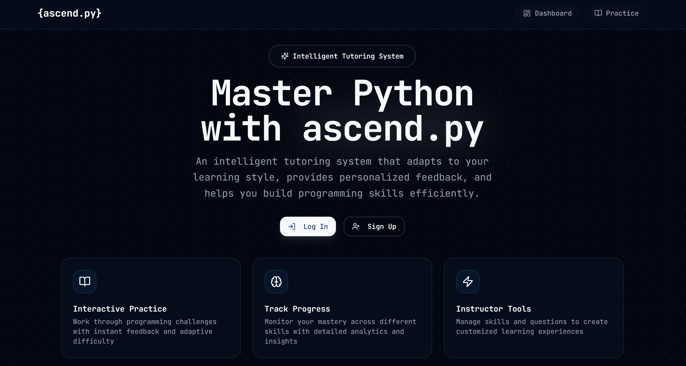
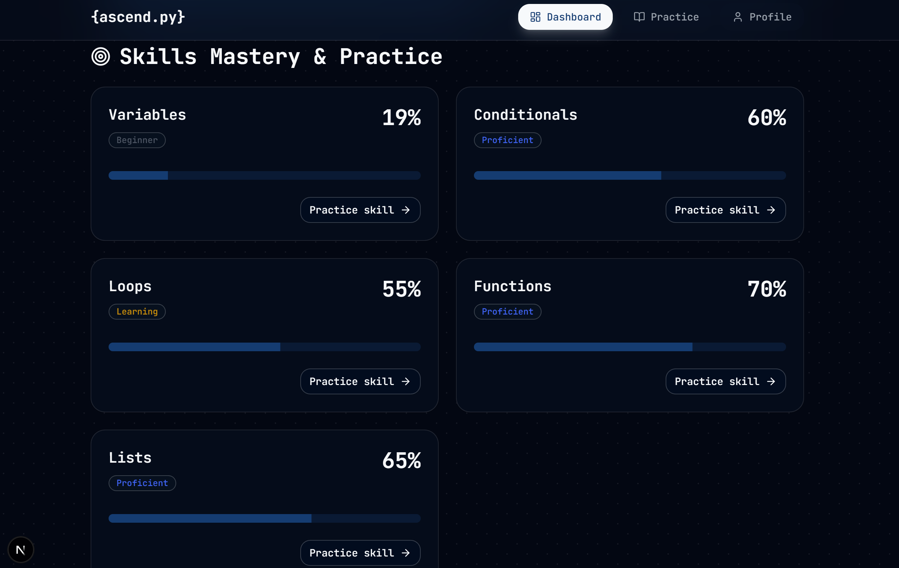
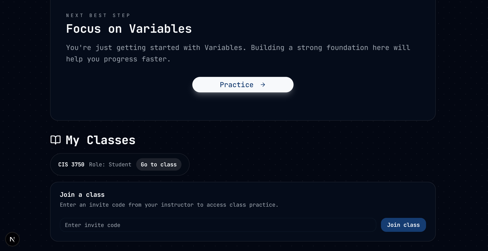
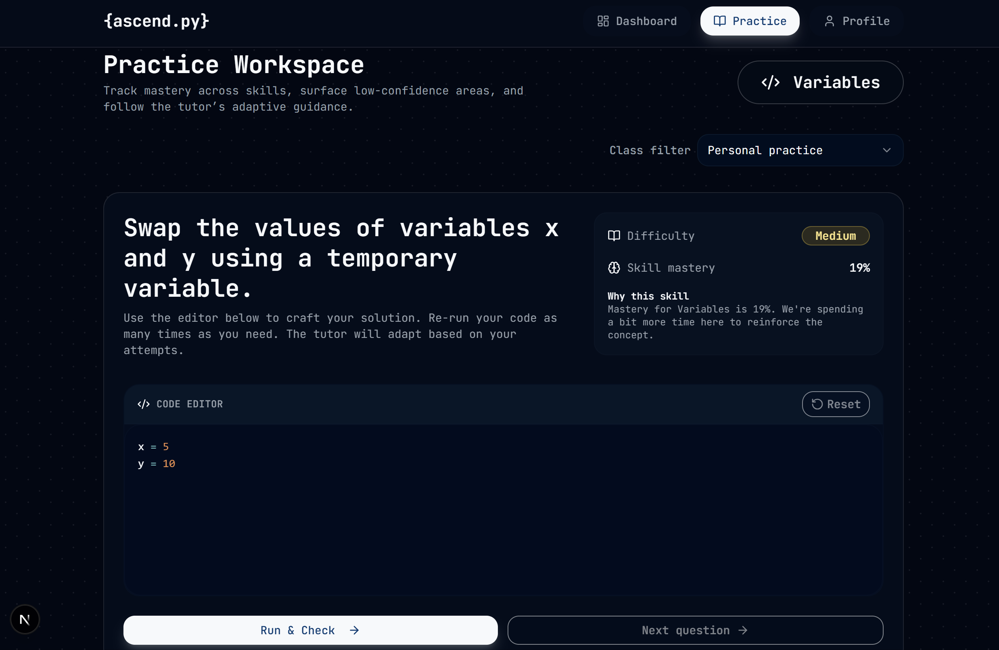

# ascend.py - Intelligent Tutoring System

An adaptive learning platform for programming education. It combines a modern Next.js app with a lightweight ML microservice to personalize practice, feedback, and recommendations.

## At a Glance
- Purpose: help learners practice coding with adaptive feedback and targeted question selection.
- Modes: rules-based tutoring (default) and ML-augmented tutoring (optional).
- Interfaces: student practice flow, progress dashboard and instructor tools

## Screenshots

### Landing Page


### Student Dashboard



### Practice Question


## How It Works
- Domain model is defined in JSON (`content/skills.json`, `content/questions.json`).
- The web app seeds and reads from Postgres via Prisma.
- Question selection prioritizes the lowest mastery skill and adapts difficulty.
- ML service adds knowledge tracing, feedback personalization, and recommendations.

## Tech Stack
- Frontend: Next.js 16 (React 18) + TypeScript
- UI: Tailwind CSS v4 + shadcn/ui
- Data: Prisma + PostgreSQL (Neon compatible)
- ML: FastAPI + scikit-learn (optional)
- CLI: Python 3.10+ prototype

## Local Setup (Web App)

### Prerequisites
- Node.js 20.9+
- PostgreSQL (or Neon)
- Python 3.10+ (for CLI/ML)

If you use `nvm`, run `nvm install` and `nvm use` to match `.nvmrc`.

### 1) Install dependencies
```bash
npm install
```

### 2) Configure environment
Set these in your shell or an `.env` file:
- `DATABASE_URL` - Postgres connection string
- `AUTH_SECRET` - long random string
- Optional: `ML_API_URL` (e.g. `http://localhost:8000`)
- Optional: `USE_ML=true` to enable ML-driven selection

### 3) Initialize the database
```bash
npx prisma migrate deploy
npx prisma db seed
```

### 4) Run the app
```bash
npm run dev
```
Open `http://localhost:3000`.

## Optional: Run the ML Service
```bash
cd ml-service
pip install -r requirements.txt
uvicorn main:app --reload --port 8000
```
Then set:
```bash
export ML_API_URL=http://localhost:8000
export USE_ML=true
```

## Testing
- `npm run test` - Vitest unit tests
- `npm run test:e2e` - Playwright smoke test (run `npx playwright install` once)

## Repo Layout
- `app/` - Next.js App Router pages and API routes
- `components/` - shared UI components
- `content/` - JSON source-of-truth for skills and questions
- `prisma/` - schema and migrations
- `ml-service/` - FastAPI ML service
- `cli/` - rules-based CLI prototype
- `scripts/` - seeding and demo helpers
- `tests/` - unit and e2e tests

## Demo Accounts (after seeding)
- Student: `student@example.com`
- Instructor: `instructor@example.com`

## Notes for Reviewers
- The rules-based mode runs without the ML service.
- The ML service is designed to be optional and composable; the web app calls it only when `USE_ML=true`.
